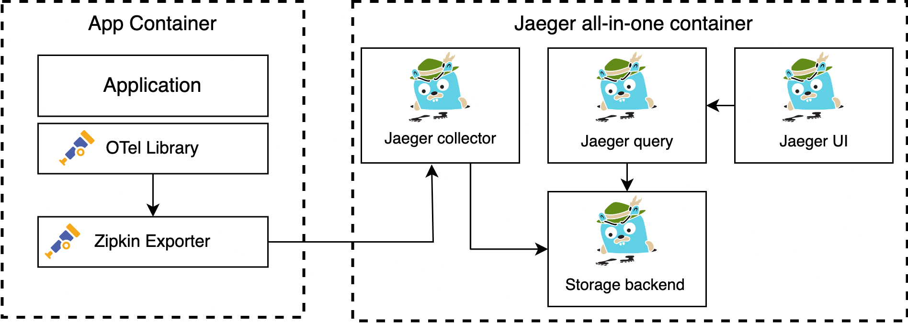
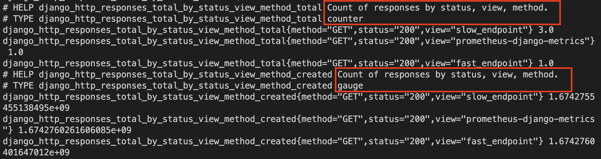

# kind-e2e

- [1 - Target setup](#1---target-setup)
- [2 - Prerequisites](#2---prerequisites)
- [3 - Quickstart](#3---quickstart)
- [4 - Project file structure](#4---project-file-structure)
- [5 - Istio as a service Mesh](#5---istio-as-a-service-mesh)
- [6 - Accessing the cluster](#6---accessing-the-cluster)
- [7 - Distributed tracing](#7---distributed-tracing)
  - [A - Meet Jaeger UI](#a---meet-jaeger-ui)
  - [B - Context propagation](#b---context-propagation)
  - [C - So what do traces look like?](#c---so-what-do-traces-look-like)
- [8 - Grafana dashboard](#8---grafana-dashboard)
- [9 - Kiali](#9---kiali)
- [10 - Jenkins](#10---jenkins)
- [11 - Clean up](#11---clean-up)
- [12 - TODO](#12---todo)
- [13 - Useful commands](#13---useful-commands)
- [14 - Tools that make your life easier](#14---tools-that-make-your-life-easier)
- [15 - Useful resources](#15---useful-resources)

Demo project powered by a k8s in Docker local cluster that hosts a distributed web app. Here is the tech stack that I have implemented:

- Service Mesh (Istio, Kiali, Virtual Service, Gateway)
- Observability: Performance metrics and logs monitoring (Grafana, Prometheus)
- Package manager (Helm charts)
- API Instrumentation (Open-Telemetry, Jaeger)
- Front-end: NodeJS (Express web framework)
- Business-logic: Python (Django web-framework)
- Self-contained CICD pipeline for testing purposes (Jenkins on k8s). The CICD pipeline does:
  - Build Docker images
  - Deploys codebase with Helm

**IMPORTANT: This guide is intended for development, and not for a production deployment.**

## 1 - Target setup

local machine (kubectl, istioctl, helm, web browser) --> kind cluster:
- Local registry
- 3 master nodes (no need to specify what's in it)
- 3 worker nodes
- Deployments:
  - front-end
  - business-logic
  - istiod
  - grafana
  - jaeger
  - prometheus
  - Kiali
  - Ingress gateway
  - jenkins:  1 master 3 slavess
- istio proxies within pods?

Website landing page (accessible at http://localhost:8080/demo-app/)


This website has only 2 interactive buttons "Slow page" and "Fast page" that are used to generate traffic into the k8s cluster.

> If you see "no healthy upstream" while trying to access the web-app, wait for a couple of seconds until the app is up and running and that should work.

In my other demo [financial-data-api](https://github.com/teddy-ambona/financial-data-api) I focused on "Plan > Code > Build > Test > Release > Deploy", now kind-e2e is targeting the "Operate > Monitor" part of the SDLC.


*source: [What is DevOps?](https://www.dynatrace.com/news/blog/what-is-devops/)*

## 2 - Prerequisites

- [Docker](https://docs.docker.com/get-docker/) (8.0 GB of memory and 4 CPUs)
- [Kind](https://kind.sigs.k8s.io/docs/user/quick-start/#installation)
- [Helm](https://helm.sh/docs/intro/install/) (v3)
- [istioctl](https://istio.io/latest/docs/setup/getting-started/#download) (v1.16.1 has been used for this demo)

## 3 - Quickstart

Run this to:

- Create k8s cluster (each node is a Docker container)
- Install Istio and its add-ons (Jaeger, Grafana, Prometheus, Kiali, Loki-stack)
- Create and expose a local Docker registry on localhost:5001

```bash
make create-cluster
```

Then build the Docker images and push them to the local Docker repository

```bash
make build-business-logic build-front-end push
```

You can then deploy the app and setup the Istio Gateway with:

```bash
make helm-app
```

In order to reach the cluster from your host you need to use port-forwarding:

```bash
make port-forward
```

You can now access the folowwing services:

- Website: [http:localhost:8080/demo-app/](http:localhost:8080/demo-app/)
- Grafana: [http:localhost:8080/grafana](http:localhost:8080/grafana)
- Jaeger: [http:localhost:8080/jaeger](http:localhost:8080/jaeger)
- Kiali: [http:localhost:8080/kiali](http:localhost:8080/kiali)

## 4 - Project file structure

```text
.
├── business-logic/
├── docs/
├── front-end/
├── helm/
├── jenkins/
├── .dockerignore
├── .gitignore
├── create-cluster.sh
├── kind-cluster-config.yaml
├── Makefile
├── README.md
```

Since this demo repo should be self-contained we put cluster configuration, app code and CICD definition in the same place but in practice `business-logic`, `front-end`, `helm` and `jenkins` should have their own repositories

in [business-logic/](./business-logic)

```text
├── business-logic/
│   ├── django_project/
│   │   └── ...
│   ├── pages/
│   │   └── ...
│   ├── Dockerfile
│   ├── manage.py
│   ├── pyproject.toml
│   └── requirements.txt
```

in [front-end/](./front-end)

```text
└── front-end/
    ├── public_html/
    │   ├── assets/
    │   │   └── ...
    │   └── index.html
    ├── Dockerfile
    ├── LICENSE.txt
    ├── package-lock.json
    ├── package.json
    ├── server.js
    └── tracing.js
```

in [helm](./helm)

```text
└── helm/
    ├── charts/
    │   ├── business-logic/
    │   │   ├── templates
    │   │   │   ├── _helpers.tpl
    │   │   │   ├── deployment.yaml
    │   │   │   └── service.yaml 
    │   │   ├── Charts.yaml
    │   │   └── values.yaml
    │   └── front-end/
    │       ├── templates
    │       │   ├── _helpers.tpl
    │       │   ├── deployment.yaml
    │       │   └── service.yaml 
    │       ├── Charts.yaml
    │       └── values.yaml
    ├── templates
    │   └── gateway.yaml
    ├── .helmignore
    ├── Charts.yaml
    └── values.yaml
```

## Helm

Helm is a package manager but also a templating and release management open-soource tool. The font-end and back-end apps are deployed through Helm using the `make helm-app` command. This command will deploy a new revised version of the charts, this is particularly useful when a rollback is needed.

## 5 - Istio as a service Mesh

A [service mesh](https://istio.io/latest/about/service-mesh/) is a dedicated infrastructure layer that you can add to your applications. It allows you to transparently add capabilities like observability, traffic management, and security, without adding them to your own code.


*source: [Istio Architecture](https://istio.io/latest/docs/ops/deployment/architecture/)*

### Istiod

Istiod (the ’d’ is for daemon )provides service discovery, configuration and certificate management.

Istiod converts high level routing rules that control traffic behavior into Envoy-specific configurations, and propagates them to the sidecars at runtime (cf [documentation](https://istio.io/latest/docs/ops/deployment/architecture/#istiod))

### Envoy

Envoy is an L7 proxy and communication bus designed for large modern service-oriented architectures. It is deployed into a Kubernetes cluster using a sidecar pattern, which means that every Istio-enabled application (or namespace, deployment, or pod) gets injected with a container running an Envoy proxy, with the necessary configuration bootstrapped into it. This process is overseen by the control plane (and its Pilot component) and abstracts Envoy’s configuration into a more high-level Istio concept. Usage of the sidecar pattern also eliminates the need to re-architect any existing infrastructure and provides a flexible way of rolling out the service mesh gradually.

Envoy provides many useful features for Istio, which can be grouped into the following rough categories:

- **traffic control and network resiliency:** load balancing, traffic throttling, rate limiting, fault injection, failover, and retry mechanisms
- **security and authentication:** the policy-enforcement point for authentication policies that define the rules of request and peer authentication
- **observability:** rich telemetry data for mesh communications, including metrics, traces, and access/audit logging
- **extensibility:** enables additional Envoy filters, WASM plugins, and allows Istio to be integrated into almost any environment

More info on [Istio & Envoy: How they work together](https://www.kubecost.com/kubernetes-devops-tools/istio-envoy/)

## 6 - Accessing the cluster

There are several ways to access the cluster from external. On Linux you can simply access the cluster using http://<LOAD-BALANCER-EXTERNAL-IP>:8080/demo-app. If you are on Windows you can use [Metallb](https://kind.sigs.k8s.io/docs/user/loadbalancer/) (baremetal loadbalancer project for kubernetes) that implements a k8s LoadBalancer without necessarily being in a hosted cloud. This works if you are on Windows but if you are running docker on MacOS like me you probably have noticed that Docker MacOS has some networking “deficiencies” and these can be overcome by installing a networking shim as explained in [this tutorial](https://www.thehumblelab.com/kind-and-metallb-on-mac/). However in this demo I used [port forwarding](https://kubernetes.io/docs/tasks/access-application-cluster/port-forward-access-application-cluster/) which is a safer way to access the application (for testing purpose) in the cluster, and this will work of any platform :smiley:. You can then access the app using http://localhost:8080/demo-app/.

### Istio Gateway

As mentioned above you can go to http://localhost:8080/demo-app/ to access the app, that is made possible thanks to Istio Gateway (the configuration is defined in [gateway.yaml](./helm/templates/gateway.yaml)). A diagram showing how this resources are connected is shown here (cf [article](https://www.alibabacloud.com/blog/north-south-traffic-management-of-istio-gateways-with-answers-from-service-mesh-experts_596658):


*source: [North-South Traffic Management of Istio Gateways](https://www.alibabacloud.com/blog/north-south-traffic-management-of-istio-gateways-with-answers-from-service-mesh-experts_596658)*

1) The client sends a request on a specific port.
2) The Server Load Balancer (SLB) listens to this port and forwards the request to the cluster (on the same port or another port).
3) Within the cluster, the request is routed to the port forwarded by the SLB which was listened to by the Istio IngressGateway service.
4) The Istio IngressGateway service forwards the request (on the same port or another port) to the corresponding pod.
5) Gateway resources and VirtualService resources are configured on the IngressGateway pod. The port, protocol, and related security certificates are configured on the Gateway. The VirtualService routing information is used to find the correct service.
6) The Istio IngressGateway pod routes the request to the corresponding application service based on the routing information.
7) The application service routes the request to the corresponding application pod.

### Add workflow diagram with Kiali

kubectl port mapping --> istio ingress --> front-end service --> front-end pod

## 7 - Distributed tracing

Distributed tracing enables users to track a request through mesh that is distributed across multiple services. This allows a deeper understanding about request latency, serialization and parallelism via visualization.

Istio leverages Envoy’s distributed tracing feature to provide tracing integration out of the box. Specifically, Istio provides options to install various tracing backends and configure proxies to send trace spans to them automatically ([cf doc page](https://istio.io/latest/docs/tasks/observability/distributed-tracing/overview/))

Note that the default sampling rate is 1%, which means that 99% of the traces won't get reported. For testing purpose we want to see all traces so I've set the sampling rate to 100% in [tracing.yaml]()

By default Istio provides service-to-service tracing without context propagation, so if service A calls B which calls C, you will get two traces A -> B and B -> C. For this demo we want something more practical such as instrumenting our application code rather than simply observing services. For this we make use of OpenTelemetry (OTel) which is the [recommended instrumentation SDK](https://www.jaegertracing.io/docs/1.40/getting-started/#instrumentation). The OTel SDK implemented within our Django and NodeJS web-apps will allow us to create custom spans.

### A - Meet Jaeger

Jaeger is a distributed tracing system released as open source by Uber Technologies. It is used for monitoring and troubleshooting microservices-based distributed systems, including:

- Distributed context propagation
- Distributed transaction monitoring
- Root cause analysis
- Service dependency analysis
- Performance / latency optimization

You can find details about how Jaeger works in the official [documentation](https://www.jaegertracing.io/docs/1.23/architecture/).

A high-level diagram of how instrumentation has been instrumented in this demo is provided below:



*Trace collection overview*

Note that the jaeger/all-in-one container is deployed through the [Istio add-on](https://istio.io/latest/docs/ops/integrations/jaeger/#installation). In case you are wondering why do we use a Zipkin exporter if we have a Jaeger backend, Jaeger backend has a [Zipkin compatible endpoint](https://www.jaegertracing.io/docs/1.40/getting-started/#all-in-one) listening on port 9411. We can then use `http://zipkin.istio-system.svc.cluster.local:9411/api/v2/spans` to send our spans to the Jaeger collector.

### B - Context propagation

Since we are using Zipkin agent, [Istio documentation](https://istio.io/latest/docs/tasks/observability/distributed-tracing/overview/) states that the B3 multi-header format should be forwarded. [B3](https://github.com/openzipkin/b3-propagation#multiple-headers) specification elaborates identifiers used to place an operation in a trace tree. For instance, the sampling decision will be made in-process and won't be collected and reported to the tracing system.

Although Istio proxies can automatically send spans, extra information is needed to join those spans into a single trace. Applications must propagate this information in HTTP headers, so that when proxies send spans, the backend can join them together into a single trace.

To do this, the front-end must collect headers from each incoming request and forward the headers to all outgoing requests triggered by that incoming request. This has been done [here]() in our NodeJS application. At the time of this writing the OTel js library does not have any plugin for axios so I had to manually propagate the context.

Here is a snapshot of what the front-end sends to the business-logic backend:


The B3 headers have been injected by OTel.

### C - So what do traces look like in Jaeger UI?

Select the trace you want to inspect. Let's select the slow page endpoint:


Latencies can be identified in the Gant diagram. Requests originate from the Ingress gateway and get propagated through the services. The bottom span "data_transformation" is the one that makes the request last roughly 3secs. Indeed there is a [time.sleep(3)]() voluntarily added in this span for demonstration purpose.


## 8 - Grafana dashboard

Grafana is a multi-platform open source analytics and interactive visualization web application. It provides charts, graphs, and alerts for the web when connected to supported data sources.

In the previous section we were able to analyze a trace, which is nice, but generally in order to troubleshoot an issue we need to see the corresponding logs and pod metrics. In this section we will see how to correlate the traces with the logs and metrics using Grafana.

### Loki stack

Loki is a horizontally scalable, highly available, multi-tenant log aggregation system inspired by Prometheus.
see [Log Monitoring and Alerting with Grafana Loki](https://www.infracloud.io/blogs/grafana-loki-log-monitoring-alerting/) for a more detailed explanation.

In short, the Promtail daemonset deploys pods that are scraping the logs from our Docker containers and shipping them to the Loki DB (they aren't persisted for this demo although you should persist logs in a production environment). Promtail also gives you the ability to filter and transform the logs along the way if need be.

Grafana's data sources, namely Jaeger and Loki are defined in [grafana_data_sources.yaml]() and there are some tweaks to be made to correlate logs, traces and metrics.

### B - Configure Loki Derived Field to extract Trace ID from the logs

The [Derived Fields configuration]() helps you add fields parsed from the log message and add a link that uses the value of the field. In our case we want to extract the Trace ID from the log message. This is necessary if you want to get this "Jaeger" button showing up in your logs.


### C - Configure trace to logs

For the traces to be correlated to logs we need to match the [service.name]() trace tag with the pod tag `app`, this is done in the [Jaeger data source definiton]()

Also, the [opentelemetry-instrumentation-logging](https://github.com/open-telemetry/opentelemetry-python-contrib/tree/main/instrumentation/opentelemetry-instrumentation-logging) python library needs to be implemented, it is a wrapper for the logging library that will output your logs in the format:

```python
%(asctime)s %(levelname)s [%(name)s] [%(filename)s:%(lineno)d] [trace_id=%(otelTraceID)s span_id=%(otelSpanID)s resource.service.name=%(otelServiceName)s] - %(message)s
```

This is essential as the span and trace IDs have to be included in the log message for Grafana to correlate the logs. Here is the [link to the documentation](https://opentelemetry-python-contrib.readthedocs.io/en/latest/instrumentation/logging/logging.html).

Now that Grafana knows how to correlate the logs with its corresponding span or trace let's check what that looks like in the UI :grinning:


### D - Metrics

Prometheus is an open-source tool for collecting metrics and sending alerts. It has [4 metric types](https://prometheus.io/docs/concepts/metric_types/):
- histogram
- counter
- gauge
- summary

Prometheus has been implemented using the python package [django-prometheus](https://github.com/korfuri/django-prometheus), now if you ssh onto the front-end container and do `curl http://business-logic.default.svc:8000/metrics` you will see a whole bunch of application metrics (see below):



What happened is that the django-prometheus library decorated the endpoints and tracks the status codes (counter) and request duration (gauge). The prometheus server (pod) will .scrape this `http://business-logic.default.svc:8000/metrics` every 5s ([see config]()) and save the result in the time-series database (ie the folder /data on the node, this is not suitable for production). Here is the general architecture of Prometheus:


*source: [Prometheus documentation](https://prometheus.io/docs/introduction/overview/)*

I have reused the [Django Prometheus dashboard available on Grafana Labs](https://grafana.com/grafana/dashboards/9528-django-prometheus/) as it is quite descriptive and provides the information we need to analyze the traffic coming into our back-end application. The dashboard is configured in [grafana.yaml]() where it is stored in a k8s config map which is itself mounted as a volume in the Grafana pod.

To find the Django Prometheus Grafana dashboard:


The dashboard looks as follow:


The values are to be read as "Number of X per second". For example if we look at the PromQL query in the Request chart (top left):


This formula means that we are aggregating the number of requests per HTTP method per Django View (endpoint) using the last 2 data points available over the last 1 minute. More info on the PromQL functions [here](https://prometheus.io/docs/prometheus/latest/querying/functions/).

#### Introducing exemplars

An exemplar is a specific trace representative of measurement taken in a given time interval. While metrics excel at giving you an aggregated view of your system, traces give you a fine grained view of a single request; exemplars are a way to link the two ([more details on that here](https://grafana.com/docs/grafana/latest/fundamentals/exemplars/)).

Note that you can play around with prometheus metrics using [this self-contained sample code](https://github.com/prometheus/client_python/blob/1fd0ded5f8c9e7101471ea06198d88427728ff50/README.md#three-step-demo) if you need to debug some code.

## 9 - Kiali

## 10 - Jenkins

## 11 - Clean up

```
# Delete kind cluster
kind delete cluster --name demo-cluster

# Delete kind Docker registry
docker kill kind-registry
```

## 12 - TODO

- Use [helm-file](https://github.com/helmfile/helmfile) to manage chart releases across several namespaces

## 13 - Useful commands

Restart pods (after config change for example):

```bash
kubectl rollout restart deployment <deployment_name> -n <namespace>
```

In order to SSH into a kind node, we must run:

```bash
docker exec -it <node-name> bash
```

Test the template rendering, but without actually installing anything:

```bash
helm install --debug --dry-run --generate-name ./mychart
```

## 14 - Tools that make your life easier

[k9s](https://k9scli.io/): For quick k8s cluster interaction (you can stop typing the time-consuming kubectl commands :smiley:)


[popeye](https://github.com/derailed/popeye): Scans live Kubernetes cluster and reports potential issues with deployed resources and configurations


## 15 - Useful resources

- [Certified Kubernetes Administrator (CKA) Course Notes](https://github.com/kodekloudhub/certified-kubernetes-administrator-course)
- [kind official documentation](https://kind.sigs.k8s.io/)
- [webhook.site](https://webhook.site): Inspect what your HTTP requests look like from a receiver perpective, very useful when you play with API instrumentation
- [Grafana dashboard best practices](https://grafana.com/docs/grafana/latest/dashboards/build-dashboards/best-practices/)
- [Prometheus Documentation](https://prometheus.io/docs/introduction/overview/)
